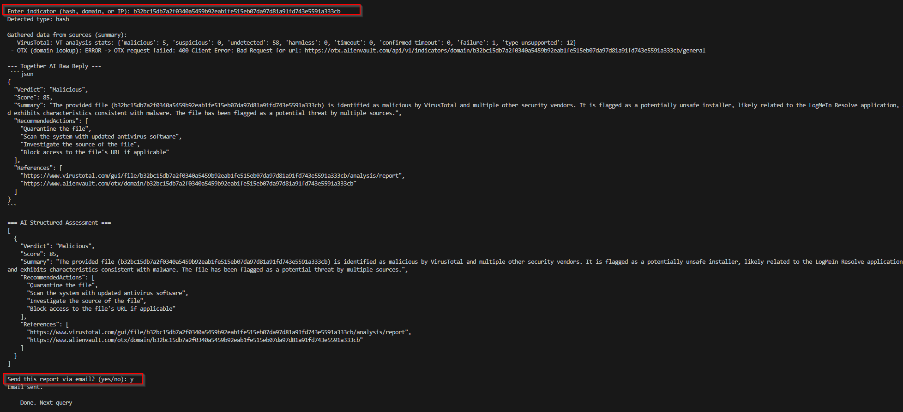

# 🔒 AI Threat Intelligence Assistant

<div align="center">


**Enterprise-grade threat intelligence powered by AI and natural language**

Analyze suspicious IPs, domains, and file hashes using natural language queries. Get comprehensive threat intelligence from multiple sources with AI-powered analysis and beautiful email reports.

[Features](#-features) • [Installation](#-installation) • [Quick Start](#-quick-start) • [Usage](#-usage) • [API Keys](#-api-keys)

---

### 🎬 See It In Action

<div align="center">

| Email Report | Terminal Analysis |
|:------------:|:-----------------:|
|  |  |
| Professional HTML email reports | Real-time threat intelligence |

</div>

</div>

---

## ✨ Features

### 🤖 Natural Language Interface
- **Talk naturally** - "Check if 8.8.8.8 is malicious"
- **Smart extraction** - Automatically finds IPs, domains, and hashes
- **Intent recognition** - Understands which services you want to use
- **Multi-indicator** - Analyze multiple indicators in one query

### 🔍 Comprehensive Threat Intelligence

#### VirusTotal Integration
- **File Analysis**: 45/72 vendors detection rates
- **Complete Metadata**: File type, size, all hash values (MD5, SHA1, SHA256)
- **File Names**: All known names and variants
- **Threat Classification**: Trojan, malware, C2 identification
- **Signature Info**: Digital signature verification
- **Timestamps**: First seen and last analyzed dates

#### AbuseIPDB Integration
- **Abuse Confidence Score**: 0-100% risk assessment
- **Report History**: Complete abuse report timeline
- **23 Attack Categories**: SSH, DDoS, Brute-Force, Phishing, etc.
- **ISP Information**: Network ownership and usage type
- **Geolocation**: Country, city, ASN details
- **Tor Detection**: Identifies Tor exit nodes
- **Community Reports**: Real-world abuse descriptions

#### AlienVault OTX Integration
- **7 Data Endpoints**: General, Reputation, Geo, Malware, URLs, Passive DNS, WHOIS
- **Threat Pulses**: 14+ threat campaigns and indicators
- **WHOIS Data**: Complete registration information including emails
- **Passive DNS**: 30+ DNS resolution records
- **Associated URLs**: All related URLs and subdomains
- **Malware Samples**: Linked malware hashes
- **Reputation Scoring**: Threat and reputation metrics

### 🎯 AI-Powered Analysis
- **Risk Scoring**: 0-100 scale with severity levels (CRITICAL, HIGH, MEDIUM, LOW)
- **Threat Classification**: Malware, C2 Server, Ransomware, Phishing, etc.
- **Comprehensive IOCs**: Emails, IPs, domains, subdomains, hashes, URLs
- **Actionable Mitigation**: 10-14 specific steps organized by priority
- **MITRE ATT&CK**: Technique references for enterprise security
- **Proper Citations**: Direct links to all sources

### 📧 Beautiful Email Reports
- **Professional HTML**: Color-coded risk levels and modern design
- **Complete Intelligence**: All data from VT, AbuseIPDB, and OTX
- **Visual Indicators**: Emoji-based status and risk levels
- **Detailed IOCs**: All indicators in organized sections
- **Mitigation Steps**: Highlighted action items
- **Clickable References**: Direct links to source reports

### 🔴 IOC Extraction (9 Types)
1. **📧 Emails** - From WHOIS and threat data
2. **🌐 IP Addresses** - IPv4 and IPv6
3. **🔗 Domains** - Root domains
4. **📡 Subdomains** - All hostnames and variants
5. **🔑 File Hashes** - MD5, SHA1, SHA256
6. **🌍 URLs** - Complete URLs
7. **📁 File Paths** - System paths
8. **🔧 Registry Keys** - Windows registry
9. **🔒 Mutexes** - Malware mutex names

---

## 🚀 Installation

### Prerequisites
- Python 3.8 or higher
- pip (Python package manager)

### Step 1: Install Dependencies

```bash
pip install python-dotenv requests
```

Or use requirements.txt:
```bash
pip install -r requirements.txt
```

### Step 2: Configure API Keys

Create a `.env` file in the project root:

```env
# ===== Threat Intel API Keys =====
VIRUSTOTAL_API_KEY=your_virustotal_key_here
ABUSEIPDB_API_KEY=your_abuseipdb_key_here
OTX_API_KEY=your_otx_key_here

# ===== Together AI API Key =====
TOGETHER_API_KEY=your_together_ai_key_here

# ===== Email Settings (Optional) =====
EMAIL_TO=recipient@example.com
EMAIL_FROM=sender@example.com
SMTP_SERVER=smtp.gmail.com
SMTP_USER=sender@example.com
SMTP_PASS=your_gmail_app_password
SMTP_PORT=587
SMTP_USE_TLS=True
```

---

## 🎮 Quick Start

### Run the Assistant

```bash
python ai_driven_threat_intel.py
```

### Example Session

```
╔════════════════════════════════════════════════════════════════╗
║   🔒 AI Threat Intelligence Assistant                         ║
║   Powered by VirusTotal, AbuseIPDB, AlienVault OTX & AI      ║
╚════════════════════════════════════════════════════════════════╝

👋 Hello! I'm your AI-powered threat intelligence assistant.
💬 Ask me anything about IPs, domains, or file hashes!

Examples:
  • 'Check if 8.8.8.8 is malicious'
  • 'Analyze domain google.com with VirusTotal'
  • 'Show me email for domain example.com using OTX'
  • 'Is this hash safe: 44d88612fea8a8f36de82e1278abb02f'

🔍 Your query: Check if 100.14.144.152 is malicious

🎯 Indicator: 100.14.144.152
📋 Type: IP

🔄 Gathering threat intelligence...
  ↳ Querying AbuseIPDB...
  ↳ Querying AlienVault OTX (detailed)...
  ↳ Querying VirusTotal...

📊 Summary from sources:
  ✓ AbuseIPDB: ✅ 0% confidence, 3 reports
  ✓ OTX: ✅ No threat pulses found
  ✓ VirusTotal: ✅ Clean

📋 Detailed AbuseIPDB Analysis:
   ✅ Abuse Confidence: 0% (CLEAN)
   📊 Total Reports: 3 (from 1 distinct users)
   🏢 ISP: Verizon Business
   🌍 Location: United States of America (US)
   
📋 Recent Abuse Reports (3 shown):
   1. 2025-11-01 - Hacking
      Comment: Attacks with Bad user agents

🤖 Analyzing with AI...

================================================================
🎯 AI THREAT ASSESSMENT
================================================================

✅ Verdict: BENIGN
📊 Risk Score: 25/100 (LOW RISK)
🔍 Threat Type: Network Infrastructure

📝 Summary:
   The IP address belongs to Verizon Business (AS701), a legitimate ISP...

🎯 Recommended Mitigation Actions:
   1. Monitor the IP address for any unusual activity
   2. Review firewall logs for traffic to and from this IP
   ...

📧 Would you like me to email this report? (yes/no): yes
✅ Email sent successfully!
```

---

## 💬 Usage Examples

### Natural Language Queries

#### Analyze an IP Address
```
🔍 Your query: Check if 8.8.8.8 is malicious
🔍 Your query: Is 1.1.1.1 safe?
🔍 Your query: What's the reputation of 192.168.1.1 on AbuseIPDB?
```

#### Analyze a Domain
```
🔍 Your query: Analyze domain google.com with VirusTotal
🔍 Your query: Check suspicious-domain.com
🔍 Your query: Show me email for domain po1s0n1vy.com using OTX
```

#### Analyze a File Hash
```
🔍 Your query: Is this hash safe: c2054617b8dcb619749c0402dc31eeb473386b3829f17176bc27b1447a8b6d92
🔍 Your query: Check hash 44d88612fea8a8f36de82e1278abb02f
```

#### Service-Specific Queries
```
🔍 Your query: Check google.com on VirusTotal
🔍 Your query: OTX analysis for example.com
🔍 Your query: AbuseIPDB check for 8.8.8.8
```

#### Multiple Indicators
```
🔍 Your query: Check 1.1.1.1 and google.com for threats
🔍 Your query: Analyze 8.8.8.8, cloudflare.com, and 1.0.0.1
```

---

## 🔑 API Keys Setup

### 1. VirusTotal (Required)
1. Sign up at [virustotal.com](https://www.virustotal.com)
2. Go to your profile → API Key
3. Copy your API key
4. Free tier: 500 requests/day

### 2. AbuseIPDB (Required)
1. Sign up at [abuseipdb.com](https://www.abuseipdb.com)
2. Go to Account → API
3. Create and copy your API key
4. Free tier: 1,000 requests/day

### 3. AlienVault OTX (Required)
1. Sign up at [otx.alienvault.com](https://otx.alienvault.com)
2. Go to Settings → API Integration
3. Copy your OTX Key
4. Free tier: Unlimited

### 4. Together AI (Required)
1. Sign up at [together.ai](https://www.together.ai)
2. Go to API Keys section
3. Create and copy your API key
4. Free tier: $25 credit

### 5. Gmail (Optional - for email reports)
1. Enable 2-Factor Authentication
2. Generate App Password:
   - Google Account → Security → 2-Step Verification → App passwords
   - Select "Mail" and your device
   - Copy the 16-character password
3. Use this in `SMTP_PASS` (not your regular password)

---

## 📊 Output Details

### For Malicious Hash Analysis

```
📋 Detailed VirusTotal File Analysis:
   🚨 Detection: 45/72 vendors flagged as malicious
   📄 File Type: Win32 EXE
   💾 Size: 13,041,664 bytes (12.44 MB)
   🔑 MD5: 77eb5b37828586664f3befcf02072ffa
   🔑 SHA1: 46101ef44977c8bd3426d410a5f2cf0b25ccf6be
   📝 Known Names: Integrator.exe, phpJqNR47
   🦠 Threat Label: trojan.xegumumune/midie
   ✍️  Signed As: Glary Utilities - Glary Utilities 5
   📅 First Seen: 2025-06-03 02:45:23
   🔄 Last Analyzed: 2025-09-18 14:38:55

🎯 AI THREAT ASSESSMENT
🚨 Verdict: MALICIOUS
📊 Risk Score: 95/100 (CRITICAL RISK)
🔍 Threat Type: Trojan / C2 Agent

🔴 Related Indicators of Compromise (IOCs):
   • File Hash (SHA-256): c2054617b8dcb619749c0402dc31eeb473386b3829f17176bc27b1447a8b6d92
   • File Hash (MD5): 77eb5b37828586664f3befcf02072ffa
   • File Name: Integrator.exe
   • Associated IP: 208.95.112.1
   • Associated Domain: ip-api.com

🎯 Recommended Mitigation Actions:
   1. Block execution of Integrator.exe on all systems immediately
   2. Quarantine the file using endpoint protection
   3. Disconnect infected systems from the network
   4. Block all related hashes, IPs, and domains at firewall
   5. Perform full EDR/antivirus scan on all systems
   6. Review firewall logs for connections to 208.95.112.1
   7. Check for scheduled tasks and registry persistence
   8. Reset credentials for compromised accounts
   9. Capture memory dumps for forensic analysis
   10. Update security signatures
   ... and 4 more actions

   ⚠️  URGENT: Immediate action required due to CRITICAL risk level!
```

### For Domain Analysis with OTX

```
📋 Detailed AlienVault OTX Analysis:
   🚨 Found in 14 threat pulse(s)
      1. 'Exposing_Malware_in20Linux-Based_Multi-Cloud_Environments' (Created: 2025-06-09)
      2. 'Cerber » Charter Communications » Spectrum Denver' (Created: 2024-09-23)
      3. 'Hijacked Operation Endgame Tofsee Ransomware' (Created: 2024-09-18)
      ... and 11 more pulses
   🔗 Associated URLs: 10 URL(s)
   🔍 Passive DNS: 30 record(s)
      • A: 18 record(s)
      • AAAA: 2 record(s)
      • NS: 6 record(s)
   📋 WHOIS: 24 field(s) found
      • Emails: lillian.rose@po1s0n1vy.com
      • Name: Lillian Rose
      • Org: Toxicodendron Inc.
      • Registrar: TUCOWS, INC.

🔴 All IOCs Extracted from OTX:
   📧 Emails: 3 found
      • domainabuse@tucows.com
      • lillian.rose@po1s0n1vy.com
      • hostmaster@retsiger.com
   🌐 IP Addresses: 9 found
      • 38.207.236.88
      • 156.254.170.147
      • 172.67.187.244
      ... and 6 more
   🔗 Subdomains: 5 found
      • lillian.po1s0n1vy.com
      • www.po1s0n1vy.com
      ... and 3 more
```

### For IP Analysis with AbuseIPDB

```
📋 Detailed AbuseIPDB Analysis:
   🚨 Abuse Confidence: 85% (HIGH RISK)
   📊 Total Reports: 156 (from 42 distinct users)
   🕐 Last Reported: 2025-11-01T14:23:45+00:00
   🌐 IP: 192.0.2.1 (IPv4, Public)
   🏢 ISP: Malicious Hosting Ltd
   📡 Usage Type: Data Center/Web Hosting/Transit
   🌍 Location: Russia (RU)
   🔴 Tor Exit Node: YES

📋 Recent Abuse Reports (5 shown):
   1. 2025-11-01 - SSH, Brute-Force, Hacking
      Comment: Multiple SSH brute force attempts
   2. 2025-10-31 - Port Scan, Hacking
      Comment: Scanning for open ports
   3. 2025-10-30 - DDoS Attack
      Comment: Participated in DDoS attack
   4. 2025-10-29 - Web App Attack, SQL Injection
      Comment: SQL injection attempts
   5. 2025-10-28 - Phishing
      Comment: Hosting phishing page
   ... and 151 more reports
```

---

## 📧 Email Report Features

### What's Included

✅ **Visual Verdict Banner** - Color-coded threat level (Red/Yellow/Green)  
✅ **Risk Score** - 0-100 scale with severity (CRITICAL/HIGH/MEDIUM/LOW)  
✅ **Threat Type** - Malware, C2 Server, Ransomware, Phishing, etc.  
✅ **Complete File Metadata** - Type, size, hashes, names, signatures  
✅ **Detection Statistics** - Vendor detection rates (45/72)  
✅ **Abuse Reports** - Complete history with categories and comments  
✅ **WHOIS Information** - Registration details and contact emails  
✅ **Passive DNS** - Complete DNS resolution history  
✅ **All IOCs** - Emails, IPs, domains, subdomains, hashes, URLs  
✅ **Mitigation Actions** - 10-14 specific, prioritized steps  
✅ **References** - Direct links to VirusTotal, AbuseIPDB, OTX  
✅ **Professional Design** - Responsive HTML, mobile-friendly  

### Risk Level Colors
- 🚨 **Red** - Malicious (Score 80-100, CRITICAL)
- ⚠️ **Yellow** - Suspicious (Score 40-79, MEDIUM/HIGH)
- ✅ **Green** - Benign (Score 0-39, LOW/MINIMAL)

---

## 🛠️ Advanced Features

### Intent Recognition

The AI understands which services you want:
- **"Check on VirusTotal"** → Uses only VT
- **"OTX analysis"** → Uses only OTX
- **"AbuseIPDB reputation"** → Uses only AbuseIPDB
- **"Check domain"** → Uses all services (default)

### WHOIS Lookup

Get contact information for domains:
```
🔍 Your query: Show me email for domain example.com
```

Returns:
- Registrant email
- Admin email
- Technical email
- Registrar information
- Creation and expiration dates

### Batch Analysis

Analyze multiple indicators at once:
```
🔍 Your query: Check 8.8.8.8, google.com, and 1.1.1.1
```

Each indicator is analyzed separately with complete reports.

---

## 📁 Project Structure

```
.
├── .kiro/
│   └── python.py              # Main application
├── .env                       # API keys (create this)
├── .env.example              # Example configuration
├── requirements.txt          # Python dependencies
├── README.md                 # This file
├── USAGE_EXAMPLES.md         # Detailed query examples
├── ENHANCED_FEATURES.md      # Feature documentation
├── ABUSEIPDB_FEATURES.md     # AbuseIPDB details
├── OTX_FEATURES_SUMMARY.md   # OTX details
└── images/                   # Screenshots
    ├── email-report-1.png
    ├── email-report-2.png
    ├── terminal-output.png
    └── email-inbox.png
```

---

## 🔐 Security Best Practices

⚠️ **Important:**
- Never commit `.env` file to version control
- Keep API keys confidential
- Use Gmail App Passwords (not main password)
- Regularly rotate API keys
- Review API usage limits

Add to `.gitignore`:
```
.env
*.pyc
__pycache__/
```

---

## 🎯 Use Cases

- **SOC Teams** - Quick threat triage and investigation
- **Incident Response** - Rapid indicator analysis with IOC extraction
- **Threat Hunting** - Proactive intelligence gathering
- **Security Research** - Malware and threat analysis
- **IT Security** - Daily monitoring and reporting
- **Forensics** - Complete indicator profiling

---

## 🚦 Service Comparison

| Feature | VirusTotal | AbuseIPDB | OTX |
|---------|-----------|-----------|-----|
| **File Analysis** | ✅ Excellent | ❌ No | ⚠️ Limited |
| **IP Reputation** | ⚠️ Basic | ✅ Excellent | ✅ Good |
| **Domain Intel** | ✅ Good | ❌ No | ✅ Excellent |
| **Abuse Reports** | ❌ No | ✅ Excellent | ⚠️ Limited |
| **Threat Pulses** | ❌ No | ❌ No | ✅ Excellent |
| **WHOIS Data** | ✅ Yes | ❌ No | ✅ Yes |
| **Passive DNS** | ⚠️ Limited | ❌ No | ✅ Excellent |
| **Malware Samples** | ✅ Excellent | ❌ No | ✅ Good |

**Recommendation**: Use all three for comprehensive coverage!

---

## 🐛 Troubleshooting

### Common Issues

**"API Key not set" errors:**
- Ensure `.env` file is in the same directory as the script
- Check variable names match exactly (e.g., `VIRUSTOTAL_API_KEY`)
- No extra spaces or quotes around values

**Email not sending:**
- Use Gmail App Password, not regular password
- Enable 2FA on Google account
- Check SMTP settings match your provider

**"Module not found" errors:**
```bash
pip install python-dotenv requests
```

**403 Forbidden errors:**
- Verify API keys are valid and active
- Check if you've exceeded rate limits
- Ensure API keys have proper permissions

**Slow responses:**
- Normal for comprehensive analysis (7+ API endpoints)
- Each query takes 10-30 seconds
- Consider using service-specific queries for faster results

---

## 📊 API Rate Limits

| Service | Free Tier | Limit |
|---------|-----------|-------|
| VirusTotal | ✅ Yes | 500 requests/day |
| AbuseIPDB | ✅ Yes | 1,000 requests/day |
| OTX | ✅ Yes | Unlimited |
| Together AI | ✅ Yes | $25 credit |

**Tip**: Monitor your usage to avoid hitting limits!

---

## 🤝 Contributing

Contributions welcome! Feel free to:
- Report bugs
- Suggest features
- Submit pull requests
- Improve documentation

---

## 📝 License

MIT License - See LICENSE file for details

---

## 🙏 Acknowledgments

Powered by:
- [VirusTotal](https://www.virustotal.com) - Malware and file scanning
- [AbuseIPDB](https://www.abuseipdb.com) - IP abuse reporting
- [AlienVault OTX](https://otx.alienvault.com) - Open threat intelligence
- [Together AI](https://www.together.ai) - AI-powered analysis

---

## 📞 Support

Need help?
1. Check [USAGE_EXAMPLES.md](USAGE_EXAMPLES.md) for query examples
2. Review [Troubleshooting](#-troubleshooting) section
3. Verify `.env` configuration
4. Check Python version: `python --version` (requires 3.8+)

---

## 🎊 What Makes This Special

### vs Traditional Tools:
- ❌ **Traditional**: Enter raw indicators, get raw data
- ✅ **This Tool**: Natural language queries, AI analysis, actionable intelligence

### vs Manual Analysis:
- ❌ **Manual**: Check 3 websites, copy/paste data, write report (30+ minutes)
- ✅ **This Tool**: One query, complete analysis, email report (30 seconds)

### vs Other Scripts:
- ❌ **Other Scripts**: Basic API calls, JSON dumps
- ✅ **This Tool**: 7+ endpoints, IOC extraction, AI correlation, beautiful reports

---

<div align="center">

**Made with ❤️ for the cybersecurity community**

⭐ **Enterprise-grade threat intelligence at your fingertips!** ⭐

</div>
